Lab4
================
Your Name
2024-09-26

``` r
library(car)
```

    ## Loading required package: carData

``` r
library(dplyr)
```

    ## Warning: package 'dplyr' was built under R version 4.2.3

    ## 
    ## Attaching package: 'dplyr'

    ## The following object is masked from 'package:car':
    ## 
    ##     recode

    ## The following objects are masked from 'package:stats':
    ## 
    ##     filter, lag

    ## The following objects are masked from 'package:base':
    ## 
    ##     intersect, setdiff, setequal, union

``` r
library(tidyr)
```

    ## Warning: package 'tidyr' was built under R version 4.2.3

``` r
library(ggplot2)
```

    ## Warning: package 'ggplot2' was built under R version 4.2.3

``` r
library(psych)
```

    ## 
    ## Attaching package: 'psych'

    ## The following objects are masked from 'package:ggplot2':
    ## 
    ##     %+%, alpha

    ## The following object is masked from 'package:car':
    ## 
    ##     logit

# Load dataset

``` r
lab4data <- read.csv("/Users/jostarenky/Documents/GitHub/Lab4/skewed.csv")
```

# Normality

## Normality Plots

``` r
ggplot(lab4data, aes(x = Performance)) + geom_histogram(binwidth = 20) + theme_classic()
```

    ## Warning: Removed 3 rows containing non-finite outside the scale range
    ## (`stat_bin()`).

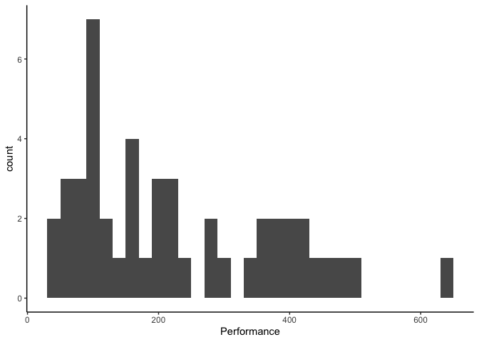<!-- -->

``` r
ggplot(lab4data, aes(x = Performance)) + geom_density(adjust = 2)  + theme_classic()
```

    ## Warning: Removed 3 rows containing non-finite outside the scale range
    ## (`stat_density()`).

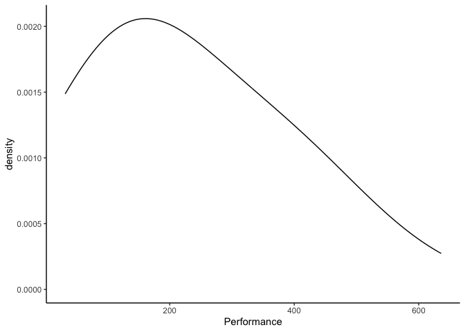<!-- -->

``` r
qq<-ggplot(lab4data, aes(sample = Performance)) + geom_qq()  + theme_classic()

qq+ geom_qq_line()
```

    ## Warning: Removed 3 rows containing non-finite outside the scale range
    ## (`stat_qq()`).

    ## Warning: Removed 3 rows containing non-finite outside the scale range
    ## (`stat_qq_line()`).

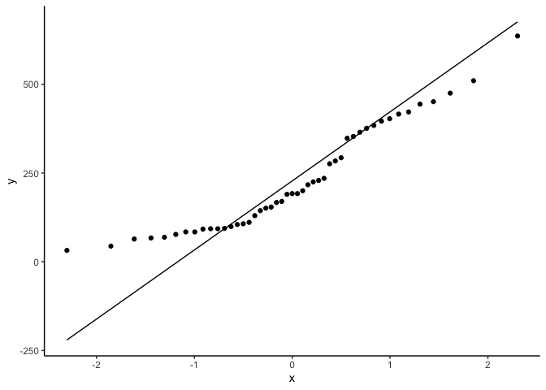<!-- -->

``` r
#functions below are base R functions, they can do the job, but not as customizable as ggplot

hist(lab4data$Performance)
```

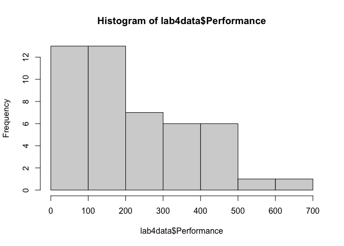<!-- -->

``` r
qqnorm(lab4data$Performance, col = "steelblue", lwd = 2)
```

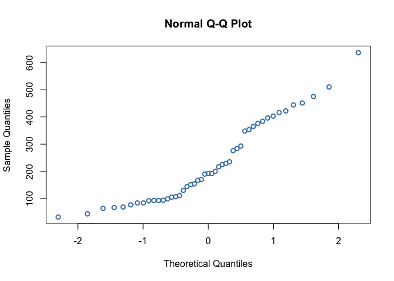<!-- -->

``` r
plot(density(lab4data$Performance, na.rm = TRUE, bw = 90),  lwd=2, main = "")
```

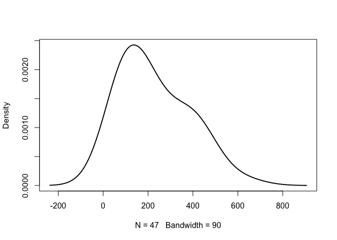<!-- -->

### Normality Plots by Group

``` r
#a fun function to plot the violin plot by group, but it's not part of ggplot
violinBy(Performance ~ Group, data = lab4data, rain= TRUE, vertical = FALSE)
```

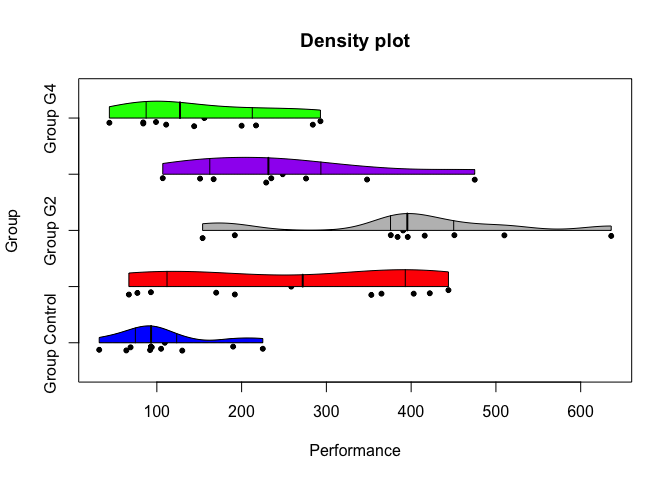<!-- -->

``` r
#Find a way to plot the histograms, density, and qq plots by groups using ggplot
ggplot(lab4data, aes(x = Performance)) + geom_histogram(binwidth = 20) + facet_wrap(~Group)+theme_classic()
```

    ## Warning: Removed 3 rows containing non-finite outside the scale range
    ## (`stat_bin()`).

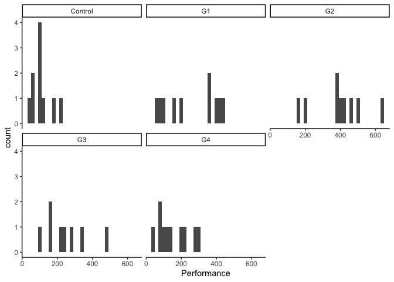<!-- -->

``` r
ggplot(lab4data, aes(x = Performance)) + geom_density(adjust = 2)  + facet_wrap(~Group)+theme_classic()
```

    ## Warning: Removed 3 rows containing non-finite outside the scale range
    ## (`stat_density()`).

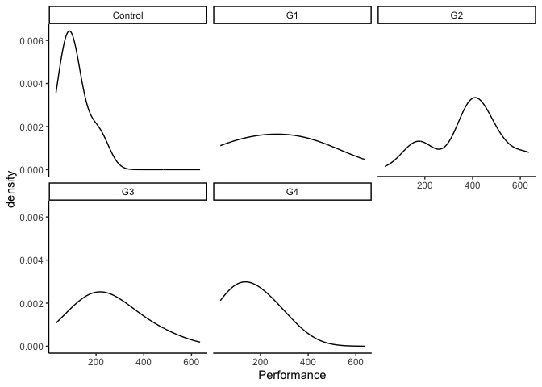<!-- -->

``` r
qq<-ggplot(lab4data, aes(sample = Performance)) + geom_qq()  + facet_wrap(~Group)+theme_classic()

qq+ geom_qq_line()
```

    ## Warning: Removed 3 rows containing non-finite outside the scale range
    ## (`stat_qq()`).

    ## Warning: Removed 3 rows containing non-finite outside the scale range
    ## (`stat_qq_line()`).

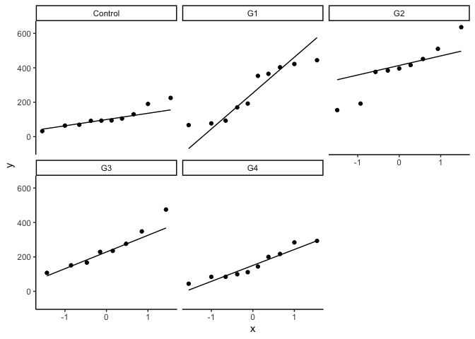<!-- -->

``` r
#Use ggplot to create a violin plot by groups
```

## Normality Tests

``` r
describe(lab4data$Performance)
```

    ##    vars  n   mean     sd median trimmed    mad min max range skew kurtosis   se
    ## X1    1 47 228.57 149.47    192  217.03 148.26  32 636   604 0.68    -0.57 21.8

``` r
shapiro.test(lab4data$Performance)
```

    ## 
    ##  Shapiro-Wilk normality test
    ## 
    ## data:  lab4data$Performance
    ## W = 0.91565, p-value = 0.002365

``` r
#shapiro test: not normal bc p is significant
#skew and kurtosis: normal
```

### Normality Tests by Group

``` r
#Use the describeBy() function to get skewness and kurtosis by group
describeBy(Performance ~ Group, data = lab4data)
```

    ## 
    ##  Descriptive statistics by group 
    ## Group: Control
    ##             vars  n  mean   sd median trimmed   mad min max range skew kurtosis
    ## Performance    1 10 109.4 58.5   93.5  104.62 40.03  32 225   193 0.72    -0.75
    ##               se
    ## Performance 18.5
    ## ------------------------------------------------------------ 
    ## Group: G1
    ##             vars  n  mean     sd median trimmed    mad min max range  skew
    ## Performance    1 10 258.6 153.32  272.5  259.38 207.56  67 444   377 -0.08
    ##             kurtosis    se
    ## Performance    -1.95 48.48
    ## ------------------------------------------------------------ 
    ## Group: G2
    ##             vars n   mean     sd median trimmed   mad min max range  skew
    ## Performance    1 9 390.56 147.68    396  390.56 81.54 154 636   482 -0.15
    ##             kurtosis    se
    ## Performance    -1.01 49.23
    ## ------------------------------------------------------------ 
    ## Group: G3
    ##             vars n  mean     sd median trimmed    mad min max range skew
    ## Performance    1 8 248.5 118.74    232   248.5 108.23 107 475   368 0.62
    ##             kurtosis    se
    ## Performance    -0.95 41.98
    ## ------------------------------------------------------------ 
    ## Group: G4
    ##             vars  n mean    sd median trimmed   mad min max range skew kurtosis
    ## Performance    1 10  156 87.65  127.5  152.88 85.99  44 293   249 0.38    -1.54
    ##                se
    ## Performance 27.72

``` r
#Use the group by function to get shapiro test results by group
lab4data %>%
  group_by(Group) %>%
  summarize(W = shapiro.test(Performance)$statistic, p_value = shapiro.test(Performance)$p.value)
```

    ## # A tibble: 5 × 3
    ##   Group       W p_value
    ##   <chr>   <dbl>   <dbl>
    ## 1 Control 0.904  0.245 
    ## 2 G1      0.860  0.0771
    ## 3 G2      0.939  0.571 
    ## 4 G3      0.939  0.600 
    ## 5 G4      0.910  0.283

``` r
#Use the filter function to get both
```

# Q1: What is your overall conclusion about this variable’s normality? Why?

This variable is not normal because even though the skew and kurtosis
values fit the normal ranges, the Shapiro test and visualizations
indicate that the variable is not normal

# Equal Variance between Groups

## Descrptive Variance

``` r
#get rid of missing values
lab4data_clean<-drop_na(lab4data)

var(lab4data_clean$Performance)
```

    ## [1] 22341.08

``` r
lab4data_clean %>%
  group_by(Group) %>%
  summarize(variance = var(Performance))
```

    ## # A tibble: 5 × 2
    ##   Group   variance
    ##   <chr>      <dbl>
    ## 1 Control    3422.
    ## 2 G1        23506.
    ## 3 G2        21810.
    ## 4 G3        14099.
    ## 5 G4         7682.

## Equal Variance Test

``` r
leveneTest(Performance~Group, lab4data)
```

    ## Warning in leveneTest.default(y = y, group = group, ...): group coerced to
    ## factor.

    ## Levene's Test for Homogeneity of Variance (center = median)
    ##       Df F value Pr(>F)  
    ## group  4  2.9461 0.0311 *
    ##       42                 
    ## ---
    ## Signif. codes:  0 '***' 0.001 '**' 0.01 '*' 0.05 '.' 0.1 ' ' 1

``` r
#cannot run MANOVA bc can't install bruce package
#MANOVA(lab4data, dv = "Performance", between = "Group")

#What if you want to test equal variance between 2 groups specifically? 

lab4dataConG1<-lab4data %>%
  filter(Group == "Control" | Group == "G1")

leveneTest(Performance~Group, lab4dataConG1)
```

    ## Warning in leveneTest.default(y = y, group = group, ...): group coerced to
    ## factor.

    ## Levene's Test for Homogeneity of Variance (center = median)
    ##       Df F value    Pr(>F)    
    ## group  1  23.017 0.0001441 ***
    ##       18                      
    ## ---
    ## Signif. codes:  0 '***' 0.001 '**' 0.01 '*' 0.05 '.' 0.1 ' ' 1

# Q2: Overall, does it meet the equal variance assumption across the groups? Why?

No, because the result was significant \# Transformation

``` r
#if any of the assumption is not met, use transformation 

lab4data$Performance_log <- log10(lab4data$Performance)
```

# Q3: Run the above tests again with the transformed outcome. Compare the differences in results.

Shapiro test is now not significant, indicating normality. Equal
variance between groups is now true. Levene’s test is not significant,
so equal variance across groups

``` r
#visualizations
ggplot(lab4data, aes(x = Performance_log)) + geom_histogram(binwidth = 20) + theme_classic()
```

    ## Warning: Removed 3 rows containing non-finite outside the scale range
    ## (`stat_bin()`).

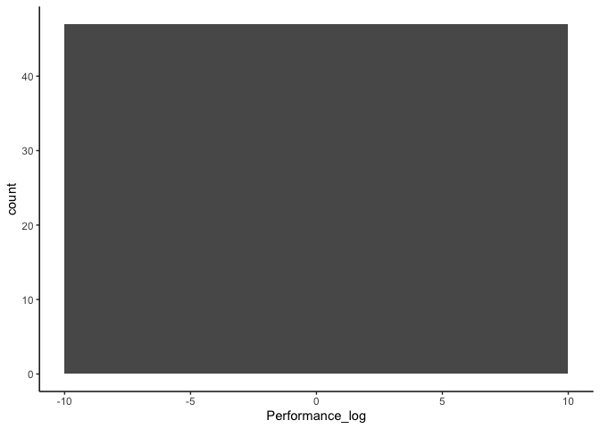<!-- -->

``` r
ggplot(lab4data, aes(x = Performance_log)) + geom_density(adjust = 2)  + theme_classic()
```

    ## Warning: Removed 3 rows containing non-finite outside the scale range
    ## (`stat_density()`).

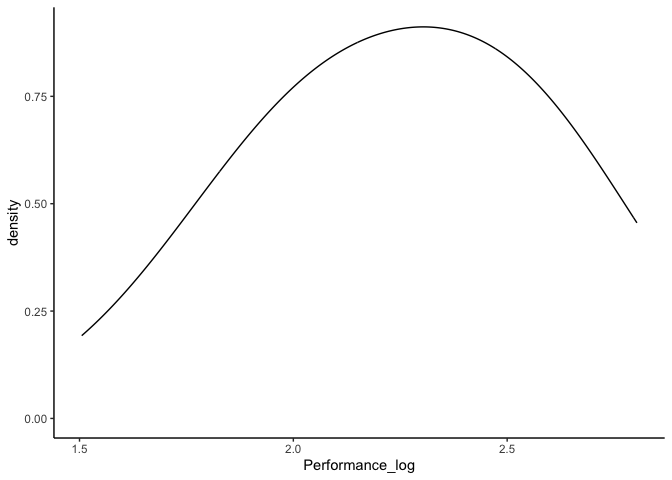<!-- -->

``` r
qq<-ggplot(lab4data, aes(sample = Performance_log)) + geom_qq()  + theme_classic()

qq+ geom_qq_line()
```

    ## Warning: Removed 3 rows containing non-finite outside the scale range
    ## (`stat_qq()`).

    ## Warning: Removed 3 rows containing non-finite outside the scale range
    ## (`stat_qq_line()`).

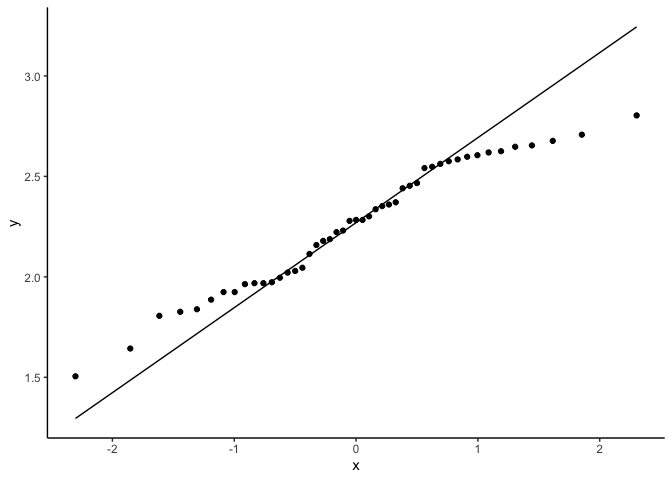<!-- -->

``` r
#Normality tests
describe(lab4data$Performance_log)
```

    ##    vars  n mean   sd median trimmed  mad  min max range  skew kurtosis   se
    ## X1    1 47 2.26 0.32   2.28    2.27 0.43 1.51 2.8   1.3 -0.26    -0.91 0.05

``` r
shapiro.test(lab4data$Performance_log)
```

    ## 
    ##  Shapiro-Wilk normality test
    ## 
    ## data:  lab4data$Performance_log
    ## W = 0.96379, p-value = 0.152

``` r
#Use the describeBy() function to get skewness and kurtosis by group
describeBy(Performance_log ~ Group, data = lab4data)
```

    ## 
    ##  Descriptive statistics by group 
    ## Group: Control
    ##                 vars  n mean   sd median trimmed mad  min  max range  skew
    ## Performance_log    1 10 1.98 0.24   1.97       2 0.2 1.51 2.35  0.85 -0.27
    ##                 kurtosis   se
    ## Performance_log    -0.64 0.08
    ## ------------------------------------------------------------ 
    ## Group: G1
    ##                 vars  n mean   sd median trimmed mad  min  max range  skew
    ## Performance_log    1 10 2.32 0.33   2.42    2.34 0.3 1.83 2.65  0.82 -0.37
    ##                 kurtosis  se
    ## Performance_log    -1.74 0.1
    ## ------------------------------------------------------------ 
    ## Group: G2
    ##                 vars n mean  sd median trimmed  mad  min max range  skew
    ## Performance_log    1 9 2.56 0.2    2.6    2.56 0.08 2.19 2.8  0.62 -0.74
    ##                 kurtosis   se
    ## Performance_log     -0.9 0.07
    ## ------------------------------------------------------------ 
    ## Group: G3
    ##                 vars n mean   sd median trimmed  mad  min  max range skew
    ## Performance_log    1 8 2.35 0.21   2.37    2.35 0.24 2.03 2.68  0.65    0
    ##                 kurtosis   se
    ## Performance_log    -1.34 0.07
    ## ------------------------------------------------------------ 
    ## Group: G4
    ##                 vars  n mean   sd median trimmed  mad  min  max range  skew
    ## Performance_log    1 10 2.12 0.27    2.1    2.14 0.28 1.64 2.47  0.82 -0.21
    ##                 kurtosis   se
    ## Performance_log    -1.29 0.08

``` r
#Use the group by function to get shapiro test results by group
lab4data %>%
  group_by(Group) %>%
  summarize(W = shapiro.test(Performance_log)$statistic, p_value = shapiro.test(Performance_log)$p.value)
```

    ## # A tibble: 5 × 3
    ##   Group       W p_value
    ##   <chr>   <dbl>   <dbl>
    ## 1 Control 0.957  0.747 
    ## 2 G1      0.850  0.0584
    ## 3 G2      0.867  0.114 
    ## 4 G3      0.989  0.994 
    ## 5 G4      0.947  0.637

``` r
#Descriptive variance
lab4data_clean<-drop_na(lab4data)

var(lab4data_clean$Performance_log)
```

    ## [1] 0.09954604

``` r
lab4data_clean %>%
  group_by(Group) %>%
  summarize(variance = var(Performance_log))
```

    ## # A tibble: 5 × 2
    ##   Group   variance
    ##   <chr>      <dbl>
    ## 1 Control   0.0582
    ## 2 G1        0.106 
    ## 3 G2        0.0389
    ## 4 G3        0.0429
    ## 5 G4        0.0708

``` r
#Equal variance across groups
leveneTest(Performance_log~Group, lab4data)
```

    ## Warning in leveneTest.default(y = y, group = group, ...): group coerced to
    ## factor.

    ## Levene's Test for Homogeneity of Variance (center = median)
    ##       Df F value Pr(>F)
    ## group  4   1.483 0.2245
    ##       42

``` r
#cannot run MANOVA bc can't install bruce package
#MANOVA(lab4data, dv = "Performance", between = "Group")

#What if you want to test equal variance between 2 groups specifically? 

lab4dataConG1<-lab4data %>%
  filter(Group == "Control" | Group == "G1")

leveneTest(Performance_log~Group, lab4dataConG1)
```

    ## Warning in leveneTest.default(y = y, group = group, ...): group coerced to
    ## factor.

    ## Levene's Test for Homogeneity of Variance (center = median)
    ##       Df F value Pr(>F)
    ## group  1  2.2281 0.1528
    ##       18
